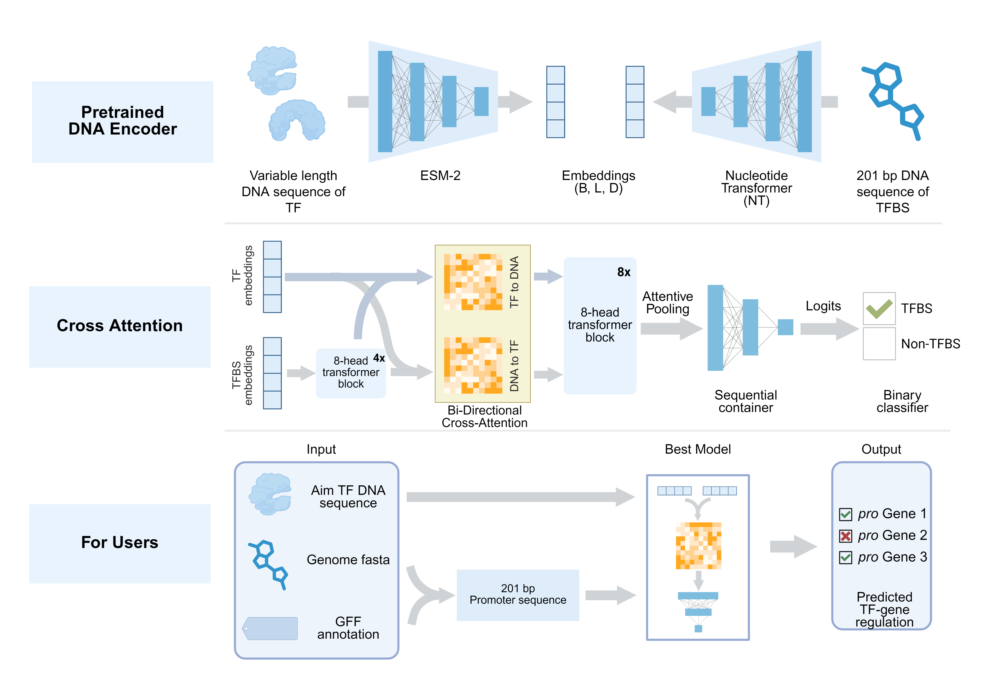

# Kleb-TF

This GitHub repository contains all the custom scripts and shell commands used in our paper,

**Global Transcription Factor Networks Reveal Conserved Gene Regulation and Key Virulence regulators in Klebsiella pneumoniae Pan-genome**.

## Graphic abstract

## Data available
All raw sequence files are uploaded to NCBI (GEO:[GSE306886](https:)).

Processed files are uploaded to [Zenodo](10.5281/zenodo.16993559).

If you have any further requests, please contact xindeng@cityu.edu.hk or beifanglu2-c@my.cityu.edu.hk. We are pleased to help!

## Code available

System requirement: Ubuntu 22.04; R version: 4.5.1.

**Notes:** We highly recommend creating a separate conda environment to manage the following software tools.

### Envs

The install time should be around 30 mins.

        conda create -n kleb-tf python=3.15 -y
        conda activate kleb-tf
        pip install -r requirements.txt

### KP-GRN predict
        usage: predict.py [-h] [-tf INPUT_TF_FASTA] [-g GENOME] [-gff GFF] [-model MODEL] [-t THRESHOLD] [-o OUTPUT]

        Predict TF and DNA binding

        options:
        -h, --help            show this help message and exit
        -tf, --input_tf_fasta INPUT_TF_FASTA
                                Directory path of input TF fasta file
        -g, --genome GENOME   Directory path of input KP isolates genome fasta file
        -gff GFF              Directory path of input KP isolates gene annotation gff file
        -model MODEL          Path to the model file
        -t, --threshold THRESHOLD
                                Prediction threshold
        -o, --output OUTPUT   Output directory path
**Example:** 
        python predict.py -tf example/RS00760.fasta -g example/hvkp4.gff -gff example/hvkp4.gff -model model.pt -t 0.95 -o result_file
## Cite us
This project is licensed under the MIT License. See the LICENSE file for details.